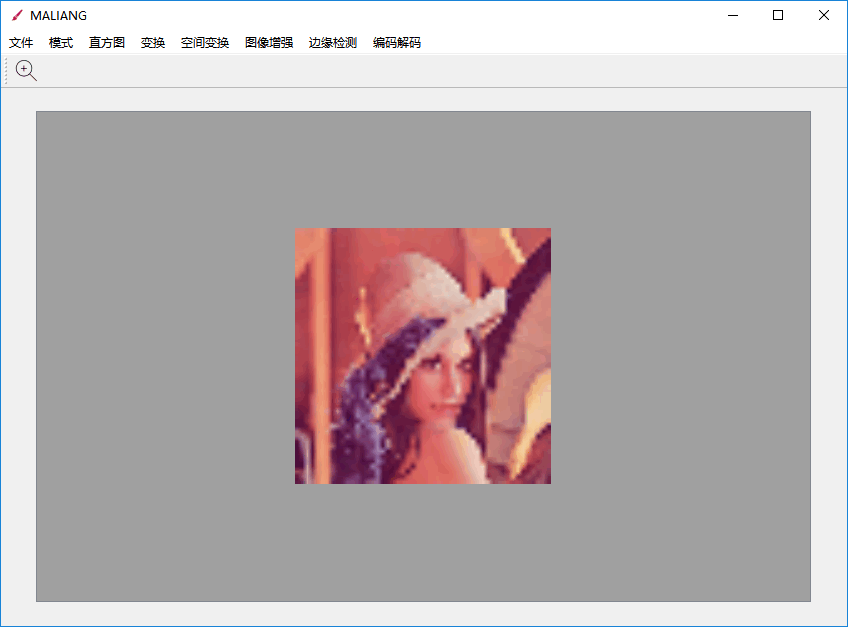

# MaLiang
数字图像处理课程个人工具

  

---

## 一、程序基本介绍   

程序中文名：马良   
程序英文名：MaLiang   
编程语言：C++   
开源许可证：[MIT License](https://github.com/InspAlgo/MaLiang/blob/master/LICENSE)    
GitHub仓库：https://github.com/InspAlgo/MaLiang    

 
## 二、程序操作流程   
### 2.1 启动程序   
进入本文档同级目录 Release 文件夹中，双击运行   MaLiang.exe 即可启动本程序。成功启动后的画面如下。   
    

### 2.2 菜单栏功能介绍   
#### 2.2.1 文件   
目前列有【新建】、【打开】、【保存】、【另存为】、【关闭】以及【关闭所有】，如下所示。  
    
目前功能已实现的有【打开】、【保存】、【另存为】和【关闭】。   

#####【打开】：   
进入选择图片对话框，目前约束选择的图片类型为 bmp/jpg/png。  
   
  
选好一张图片后点击打开，即可显示，显示的照片会自动调整显示控件尺寸以维持显示的图片长宽比例不变，如下所示。    
    

##### 【保存】：    
将界面上的图片保存回原位置，会重新覆盖。  
##### 【另存为】：    
进入保存图片对话框，目前约束保存的图片类型为 bmp/jpg/png。  
   

##### 【关闭】：   
关闭当前工作区，即清除当前界面上正显示的图片。   
   

#### 2.2.2 模式   
目前列有【灰度】、【8位切片】、【二值化】、【Floyd-Steinberg 抖动】、【txt字符画】以及【24位真彩图转256色】，如下所示。   
    
##### 【灰度】：   
将最初导入的图片以灰度图形式显示。   
   
##### 【8位切片】：   
把最初导入的8位图片转化为8幅位平面表示的二值图，同时保存在导入的图片的同级目录下。    
  
##### 【二值化】：    
显示最初导入的图片的二值化图像，同时有滑动条可以进行动态调节。    
    
再次点击本选项后可关闭滑动条。    

##### 【Floyd-Steinberg 抖动】：   
显示最初导入的图片经过Floyd-Steinberg抖动处理后的图像。  
    
    

##### 【txt字符画】：   
将最初导入的图片转换为txt字符文本，并保存在图片同级目录下。  
    
    
在第一次检查中，发现此功能的检查结果为未实现，很奇怪，可能是测试用图太大，以及中文路径的原因，最主要的问题应该还是测试用图太大，本次提交的作业特意选取了一些本地测试用图。见同目录下的 **ImageTestSet** 文件夹。

##### 【24位真彩图转256色】  
将最初导入的图片由24位真彩色转换为256色显示。

原图   
   
转换后  
    

#### 2.2.3 直方图   
目前列有【灰度直方图】以及【均衡化】，如下所示。   
    
##### 【灰度直方图】：   
显示当前显示的图片的灰度直方图信息。    
   

##### 【均衡化】：    
显示最初导入的图片经过直方图均衡化处理后的图片。   
    
    
 
#### 2.2.4 变换    
目前列有【线性变换】、【负片】、【拉普拉斯变换】、【对数变换】以及【伽马变换】，如下所示。    
    

##### 【线性变换】：    
将最初导入的图片以经过线性变换处理后的效果显示，支持设置参数。    
   
   
   

##### 【负片】：    
显示最初导入的图片的负片效果。    
    

##### 【拉普拉斯变换】：   
显示最初导入的图片经过拉普拉斯变换处理后的效果，目前使用的是边缘检测的模板。    
   
   

##### 【对数变换】：    
显示最初导入的图片经过对数变换处理后的效果，参数可调。   
     
    

##### 【伽马变换】：    
显示最初导入的图片经过伽马变换处理后的效果，参数可调。   
    
    

#### 2.2.5 空间变换
目前列有【最近邻插值缩放】、【双线性插值缩放】、【旋转】以及【平移】，如下所示。
   

##### 【最近邻插值缩放】  
显示最初导入的图片经过最近邻插值缩放处理后的效果，参数可调。
需要注意的是，由于本程序的显示控件会自动调整自适应大小，所以放大或缩小图片时看不出变化，这时需要点击保存或另存为，就会发现新保存的图片的尺寸会发生改变。   
原图  
   
设置参数   
   
转换后   
   

##### 【双线性插值缩放】  
显示最初导入的图片经过双线性插值缩放处理后的效果，参数可调。  
需要注意的是，由于本程序的显示控件会自动调整自适应大小，所以放大或缩小图片时看不出变化，这时需要点击保存或另存为，就会发现新保存的图片的尺寸会发生改变。   
原图  
   
设置参数   
   
转换后   
   
##### 【旋转】  
显示最初导入的图片经过旋转处理后的效果，参数可调。  
选择操作会新建一个画布，然后再画出旋转后的图像，因为有些角度会使得图像超过边界，为了包括起来就新建了一个大画布，所以看起来会有点奇怪。。   
原图  
   
设置参数   
   
转换后   
   

##### 【平移】  
显示最初导入的图片经过平移处理后的效果，参数可调。  
选择操作会新建一个画布，然后再画出平移后的图像，因为有些平移会使得图像超过边界，为了包括起来就新建了一个大画布，所以看起来会有点奇怪。。   
原图  
   
设置参数   
   
转换后   
   

#### 2.2.6 图像增强  
目前列有【均值平滑】、【中值平滑】、【K邻域平滑】、【最小均方差平滑】、【Roberts锐化】、【Sobel锐化】、【Laplace锐化】以及【自定义卷积模板】，如下所示。   
   

##### 【均值平滑】   
显示最初导入的图片经过均值平滑处理后的效果。   
原图   
   
平滑处理后   
   

##### 【中值平滑】   
显示最初导入的图片经过中值平滑处理后的效果。   
原图   
   
平滑处理后   
   

##### 【K邻域平滑】   
显示最初导入的图片经过K邻域平滑处理后的效果。   
原图   
   
平滑处理后   
   

##### 【最小均方差平滑】     
显示最初导入的图片经过最小均方差平滑处理后的效果。   
原图   
   
平滑处理后   
   

##### 【Roberts锐化】    
显示最初导入的图片经过Roberts锐化处理后的效果。   
原图   
   
平滑处理后   
   

##### 【Sobel锐化】    
显示最初导入的图片经过Sobel锐化处理后的效果。   
原图   
   
平滑处理后   
   

##### 【Laplace锐化】   
显示最初导入的图片经过Laplace锐化处理后的效果。   
原图   
   
平滑处理后   
   

##### 【自定义卷积模板】   
显示最初导入的图片经过自定义卷积模板处理后的效果。   
原图   
   
设置参数  
  
平滑处理后   
   

#### 2.2.7 边缘检测 
目前列有【Laplace算子】、【Kirsch方向算子】、【边缘跟踪】以及【霍夫变换检测直线】，如下所示。   
   

##### 【Laplace算子】   
显示最初导入的图片经过Laplace算子处理提取边缘后的效果。   
原图    
    
提取边缘   
   

##### 【Kirsch方向算子】   
显示最初导入的图片经过Kirsch方向算子处理提取边缘后的效果。   
原图    
    
提取边缘   
   

##### 【边缘跟踪】   
显示最初导入的图片经过边缘跟踪处理后的效果。   
原图    
    
处理后   
   

##### 【霍夫变换检测直线】    
显示最初导入的图片经过霍夫变换检测直线处理后的效果。   
原图    
    
处理后   
   

#### 2.2.8 编码解码
目前列有【Huffman编码】、【Huffman解码】、【游程长度编码】以及【游程长度解码】，如下所示。   
   

##### 【Huffman编码】   
需要提前创建一个空白文件，然后再选择，则会将显示的图片编码到此文件中。   
编码前   
  
选择存储编码的文件  
   
编码后  
   

##### 【Huffman解码】   
选择之前对应编码的文件，打开即可。   
选择文件   
   
解码   
   

##### 【游程长度编码】   
需要提前创建一个空白文件，然后再选择，则会将显示的图片编码到此文件中。这里游程长度编码会先将图片处理成二值图再进行编码。   
编码前   
  
选择存储编码的文件  
   
编码后  
   

##### 【游程长度解码】   
选择之前对应编码的文件，打开即可。   
选择文件   
   
解码   
   

#### 2.2.9 Matlab部分
本matlab程序启动非常慢，需要等待一会。打开后的界面   
   
本部分只有图像变换功能，具体包括【傅里叶变换】、【离散余弦变换】以及【小波变换】，如下图所示。
   

##### 【傅里叶变换】   
原图  
    
变换后   
    

##### 【离散余弦变换】   
原图   
    
变换后   
   

##### 【小波变换】   
原图   
    
变换后   
    